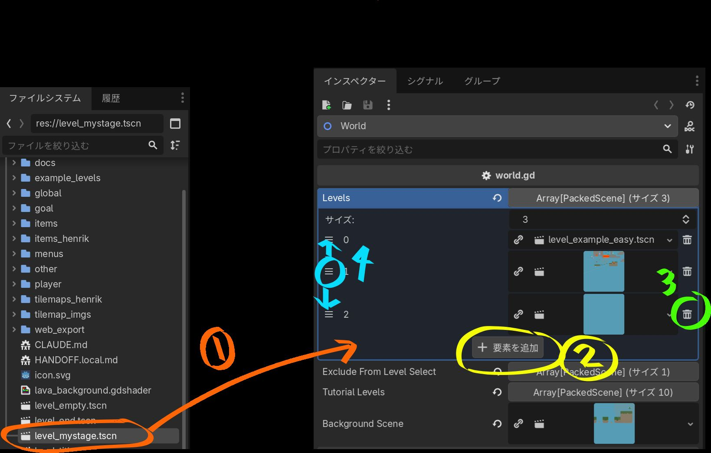
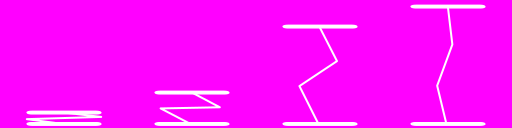
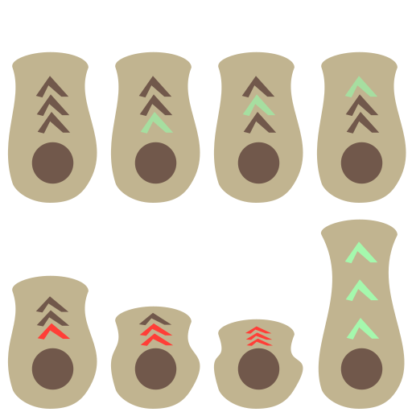
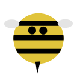
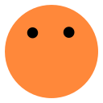
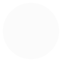

# Seminar Land

**Godot**（ゲームを作る無料のソフト）を使って、**自分だけのステージ**を作ってみましょう！
プログラミングが初めての人でも大丈夫です。順番に進めていきましょう。

> ✅ **対応バージョン**：このゲームは **Godot 4.6** で動作確認しています。

> **ステージ**＝ゲームの「面（ステージ）」のことです。このチュートリアルでは
> 「レベル」ではなく「ステージ」と呼びます。

このゲームは、**難しいコードを書かなくても**、用意された部品を並べるだけで
自分のステージが作れるように設計されています。さらに、少しコードを書けば、
見本を参考に**自分だけの部品（アイテム）**を作ることもできます。Godot の言語は
Python によく似ているので、プログラミングに挑戦したい人にもぴったりです。
自信がある人は、ゲームを好きなだけ拡張していけます。安心してどんどん試して
ください。

> ℹ️ **このチュートリアルについて**
> これは、すべてを一から十まで説明する完全な手引きではありません。授業の
> **補助教材**として、また授業が終わったあとも自分で作り続けられるように
> 用意したものです。細かい部分でつまずいたら、先生に聞いたり、AI
> （コーディング支援）に手伝ってもらったりしながら進めてください。
>
> このチュートリアルは、実際の**基礎セミナー**の中の 90分×4回を使って学生と一緒に
> Godot に取り組んだ経験をもとに、担当教員が用意したものです。授業では、部品（アイテム）を自作
> したり、その絵を Microsoft ペイントで描いたりもしました（絵の描き方自体は
> このチュートリアルでは扱っていません）。

---

## 🎮 まずは体験してみよう

実際に遊んでいる様子は、下の**デモ動画**で見られます。
インストールしなくても、**ブラウザですぐに遊べる体験版**も用意してあります。

<div style="position:relative;padding-bottom:56.25%;height:0;overflow:hidden;max-width:800px;margin:1em 0;">
  <iframe style="position:absolute;top:0;left:0;width:100%;height:100%;" src="https://www.youtube-nocookie.com/embed/iGnPzkEUrkA" title="Seminar Land デモ動画" frameborder="0" allow="accelerometer; encrypted-media; gyroscope; picture-in-picture" allowfullscreen></iframe>
</div>

<p>
  ▶ <a href="https://seminar-land-default.netlify.app/" target="_blank" rel="noopener"><strong>ブラウザ版で遊んでみる</strong></a>（別のタブで開きます。ダウンロード不要）
</p>

---

## もくじ

1. [Godot をインストールする](#1-godot-をインストールする)
2. [プロジェクトを開いて遊んでみる](#2-プロジェクトを開いて遊んでみる)
3. [自分のステージを作る（コピーする）](#3-自分のステージを作るコピーする)
4. [ステージを一覧に登録する](#4-ステージを一覧に登録する)
5. [アイテムやタイルで組み立てる](#5-アイテムやタイルで組み立てる)
6. [（応用）簡単なアイテムを自作する](#6応用簡単なアイテムを自作する)
7. [フォルダ地図（どこに何があるか）](#7-フォルダ地図どこに何があるか)
8. [困ったときは](#8-困ったときは)
9. [AI（コーディング支援）について](#9-aiコーディング支援について)

---

## 1. Godot をインストールする

1. 公式サイトを開きます → <https://godotengine.org/download>
2. **Godot**（Standard 版でOK）を、自分のパソコン用にダウンロードします。
3. ダウンロードしたファイルを解凍して、出てきたアプリを起動します。
   インストール作業はなく、そのまま起動できます。

> 💡 ページ上部の**対応バージョン**に合わせてください。バージョンが大きく
> 違うと、うまく開けないことがあります。

---

## 2. プロジェクトを開いて遊んでみる

1. Godot を起動すると「プロジェクトマネージャー」が開きます。
2. 右上の **「インポート（Import）」** を押します。
3. このゲームのフォルダの中にある **`project.godot`** を選びます。
4. 一覧に「Seminar Land」が出てくるので、ダブルクリックで開きます。
5. エディタが開いたら、右上の **▶（実行）ボタン** か **F5** キーを押します。

操作方法：

| キー | 動き |
| --- | --- |
| ← → | 左右に移動 |
| スペース | ジャンプ |
| Esc | メニューにもどる |

旗（🚩）に触るとステージクリアです。まずはお手本のステージで遊んでみましょう。

---

## 3. 自分のステージを作る（コピーする）

新しいステージは、**空っぽのテンプレート `level_empty.tscn` をコピー**して
作ります。これにはもう **プレイヤーと旗（ゴール）が入っている**ので、すぐに
遊べる形になっています。

1. 画面左下の **「FileSystem（ファイルシステム）」** パネルを見ます。
2. `level_empty.tscn` を **右クリック → 複製（Duplicate）**。
3. 名前を、たとえば `level_mystage.tscn` のように付けます。
   （半角の英数字で、`level_` から始めると分かりやすいです。）
4. できた `level_mystage.tscn` を **ダブルクリック**して開きます。

これであなたのステージが1つできました！　中には最初から

- **player**（プレイヤー）
- **flag**（ゴールの旗）
- **tilemap**（地面を描くための下じき）

が入っています。

> 💡 旗は「ステージクリア」の合図を出す大事な部品です。**ステージには必ず
> 1つ**置いておきましょう（テンプレートには最初から入っています）。

---

## 4. ステージを一覧に登録する



作ったステージを、ゲームの**ステージ一覧に登録**しないと、遊ぶ画面に出てきません。
登録は `world.tscn` の **`levels`（ステージ一覧）** に追加するだけです。
エンジンのコードを書き変える必要はありません。

1. FileSystem で **`world.tscn`** をダブルクリックして開きます。
2. 左の「Scene（シーン）」パネルで、一番上の **`World`** ノードをクリック。
3. 右の **「Inspector（インスペクター）」** に **`Levels`** という項目があります。
   これがステージの一覧です。
4. ステージを一覧に**追加**するには、次の2つのやり方があります。どちらでもOKです。
   - **①ドラッグ＆ドロップ**：FileSystem から自分の **`level_mystage.tscn`** を、
     `Levels` の一覧に直接ドラッグして落とすと、新しい枠が増えてそこに入ります。
   - **②ボタンで追加**：`Levels` の下の **「＋ 要素を追加」** ボタンを押すと空っぽの枠が
     増えます。その枠にステージを入れる方法は2通りです。
     - FileSystem から `level_mystage.tscn` を、その枠にドラッグして入れる。
     - 枠に出てくる**フォルダのアイコン**をクリックし、開いたメニューの
       **「クイックロード」／「読み込み」** から `level_mystage.tscn` を選ぶ。
5. **③削除**：いらなくなったステージは、その行の右にある**ゴミ箱ボタン**で一覧から
   外せます。一覧から外れるだけで、ステージのファイル自体は消えません。
6. **④順番の入れ替え**：一覧の**上から順番**に遊ぶことになります。各行の左にある
   **≡（並べ替えハンドル）** を上下にドラッグすると、順番を入れ替えられます。
7. **Ctrl+S** で保存し、**F5** で実行して確認しましょう。

> 💡 **`Exclude From Level Select`**（ステージ選択から隠す）に入れると、
> 順番に遊ぶときには出てくるけれど「ステージ選択」画面には出ない、
> という隠しステージにできます。フィナーレ用の `level_end` がその例です。

> 💡 **`Tutorial Levels`**（チュートリアル）は、普通の `Levels` とは別の一覧です。
> ここにステージを入れると、メインメニューに **「チュートリアル」** ボタンが自動で
> 出てきます（1つも入れなければ出ません）。その画面では「順番にプレイ」で全部
> 続けて遊ぶことも、一覧から1つずつ選ぶこともできます。`Levels` とは別なので、
> 「スタート」の連続プレイには含まれません。

---

## 5. アイテムやタイルで組み立てる

ステージの中身は、**完成品のアイテム**と**タイル（地面）**を置いて作ります。

### タイル（地面）を描く

1. ステージのシーンの中の **`tilemap`** ノードをクリックします。
2. 画面下に **TileMap** の編集パネルが出ます。タイルを選んで、キャンバス上を
   クリック／ドラッグすると地面が描けます。
3. 消したいときは右クリック（または消しゴム）で消せます。

地面のタイルの絵は `tilemap_imgs/` に入っています（普通の地面、石、緑など）。

> 💡 **溶岩（ラバ）について**：ステージの一番下（下に落ちる場所）は、いつも
> 溶岩になっていて、落ちるとミスになります。これは変えられません。ステージの
> 上のほうにも溶岩を置きたいときは、専用の**溶岩タイルマップ**
> `tilemaps_henrik/lava_tilemap.tscn` を使います。普通の地面タイルとは別で、
> アニメーションつき、触れるとミスになる特別なタイルです。ステージにドラッグ＆
> ドロップで置いてから、上と同じ手順で描けます。

### 完成品のアイテムを置く

`items_henrik/` フォルダには、すぐ使えるアイテムがそろっています。
名前をクリックすると、**詳しい使い方のページ**が開きます。

| 見た目 | ファイル | どんなアイテム？ |
| --- | --- | --- |
|  | [spring.tscn](items/spring.md) | ばね。乗ると高くジャンプ。 |
|  | [cannon.tscn](items/cannon.md) | 大砲。プレイヤーを発射！ |
|  | [bee.tscn](items/bee.md) | ハチ（うごく敵）。 |
|  | [fireball.tscn](items/fireball.md) | 火の玉。 |
|  | [garigari.tscn](items/garigari.md) | 回るノコギリ（危険）。 |
|  | [key.tscn](items/key.md) | カギ。集めるしかけに使えます。 |
|  | [platform.tscn](items/platform.md) | 足場（スクリプトなし）。 |
|  | [gravity_flip.tscn](items/gravity_flip.md) | 重力逆転。 |
|  | [timeout.tscn](items/timeout.md) | 時間制限。 |
| 🏷️ | [stage_title.tscn](items/stage_title.md) | ステージ名の表示（開始時にふわっと出る）。 |

**→ [アイテム図鑑（一覧ページ）](items/index.md)** で、絵つきの一覧を見られます。

置き方：

1. FileSystem で使いたい `.tscn`（例：`spring.tscn`）を選びます。
2. それを、開いている自分のステージの **キャンバスにドラッグ＆ドロップ**します。
3. 置いた部品は、ドラッグで動かしたり、Inspector で設定を変えたりできます。

> 💡 **ステージ名を出したい**ときは `stage_title.tscn` を1つ置いて、Inspector の
> **`Stage Title`** に好きな名前を入れましょう。この名前はステージ選択の
> ラベルにも使われます。

---

## 6.（応用）簡単なアイテムを自作する

もう少しやってみたい人は、**自分でアイテムを作る**のに挑戦してみましょう。
お手本が `items/` フォルダにあります。

- `items/item_speed.gd` … 触ると**速くなる**アイテム
- `items/gravity_flip.gd` … 触ると**重力が逆転**するアイテム

### アイテムの仕組み（「アドイン」方式）

このゲームのアイテムは、すべて**独立した `Area2D`**です。プレイヤーが範囲に
入ると `_on_body_entered(body)` という関数が呼ばれます。この `body` が
プレイヤーです。プレイヤーの**公開された変数**と**シグナル**だけを通して
性能を変えるので、**`player.gd` も `world.gd` も書き変えません。**

触れるもの：

| 名前 | 意味 |
| --- | --- |
| `body.SPEED` | 走る速さ |
| `body.JUMP_VELOCITY` | ジャンプの強さ（マイナスが上向き） |
| `body.GRAVITY_SCALE` | 重力の強さ（1.0 が標準） |
| `body.scale` | プレイヤーの大きさ |
| `body.died`（シグナル） | ミスにする合図 |
| `body.level_complete`（シグナル） | クリアにする合図 |

### 一番簡単な例

```gdscript
extends Area2D
# 触ると速くなるアイテム

@export var SPEED_BONUS = 150.0  # 足す速さ

func _on_body_entered(body: Node2D) -> void:
    body.SPEED += SPEED_BONUS   # プレイヤーを速くする
    queue_free()                # アイテムを消す（使い切り）
```

### ほぼコードなしの改造アイデア

- `SPEED_BONUS` の数字を変える → 速くなる量が変わる
- `body.SPEED += SPEED_BONUS` を `body.JUMP_VELOCITY -= SPEED_BONUS` にする → ジャンプ力アップ（`JUMP_VELOCITY` はマイナスが上向きなので、**引く**ほど高く跳ぶ）
- `body.GRAVITY_SCALE` を変える → 軽い／重いアイテム
- `body.scale` を変える → 小さく／大きくなるアイテム

自作したアイテムも、`items_henrik/` の完成品と同じように、ステージへ
ドラッグ＆ドロップで置けます。

> 📘 **もっと詳しく作りたい人へ**：シーンの作り方、当たり判定（コリジョン）の
> しくみ、`@export` の使い方、トラップやふうせんなどの例までを、
> **[アイテムを一から自作する](making-items.md)** のページでステップごとに
> 説明しています。

> 💡 **ルール**：アイテムは `player.gd` や `world.gd` を書き変えません。
> かならず「公開変数」と「シグナル」だけを通してプレイヤーに触れましょう。
> こうすると、みんなのアイテムがぶつからずに動きます。

---

## 7. フォルダ地図（どこに何があるか）

| フォルダ／ファイル | 中身 |
| --- | --- |
| `world.gd` / `world.tscn` | ゲーム本体（メニュー・ステージ一覧・ボタン）。**普通は触りません。** |
| `player/` | プレイヤー（`player.gd`、絵）。 |
| `goal/` | ゴールの旗（`flag.tscn`）。 |
| `level_empty.tscn` | **ステージのテンプレート**（コピー元）。プレイヤーと旗つき。 |
| `example_levels/` | お手本のステージ集（`level_cannon.tscn` ほか）。 |
| `items/` | **自作アイテムのお手本**（簡単な例）。 |
| `items_henrik/` | 完成品のアイテム集（ばね・大砲・ハチ・カギ…）。 |
| `tilemap_imgs/` | 地面を描くタイルの絵（普通の地面・石・緑など）。 |
| `tilemaps_henrik/` | 専用の**溶岩タイルマップ**（`lava_tilemap.tscn`）。触れるとミスになる特別なタイル。 |
| `menus/` / `global/` / `other/` | 補助的な部品（メニューや演出）。 |

---

## 8. 困ったときは

- **ステージが一覧に出てこない** → `world.tscn` の `Levels` に追加して保存したか
  確認しましょう（[4章](#4-ステージを一覧に登録する)）。
- **ゴールできない** → ステージに旗（`flag`）が1つ入っているか確認しましょう。
- **旗（ゴール）が見えない・通れない** → カギを置いていませんか？ カギを1つでも
  置くと、旗はカギを**全部集めるまで**かくれます（[カギ](items/key.md)）。
- **アイテムが反応しない** → `Area2D` の `body_entered` シグナルが、関数
  `_on_body_entered` につながっているか確認しましょう。
- **開けない／エラーが出る** → Godot のバージョンがページ上部の**対応バージョン**に
  合っているか確認しましょう。

楽しいステージができたら、ぜひ友だちに遊んでもらいましょう！🎮

---

## 9. AI（コーディング支援）について

このゲームの設計・仕組み・アートは作者によるものです。作者自身がゲームのコード
（バネ・大砲・ハチ・のこぎり・カギ・重力反転などの完成品アイテムを含む）を書き、
すべてのコードをレビューして動作を確認しています。コードの一部は、AIコーディング
支援ツール（**Anthropic の Claude**／*Claude Code*）の助けを借りて書きました。
作者が骨組みを用意して方針を決め、`world.gd` の細かい実装の多く、画面上のタッチ
キーボード、日英併記のコード内ドキュメントの多くを、このツールが担当しました。

> コードが書ける・読めることは今も大切です。骨組みを設計し、AIに指示を出し、
> 出てきたコードを見極めて直せるのは、その力があるからこそです。AIは道具であって、
> 「理解していること」の代わりにはなりません。
