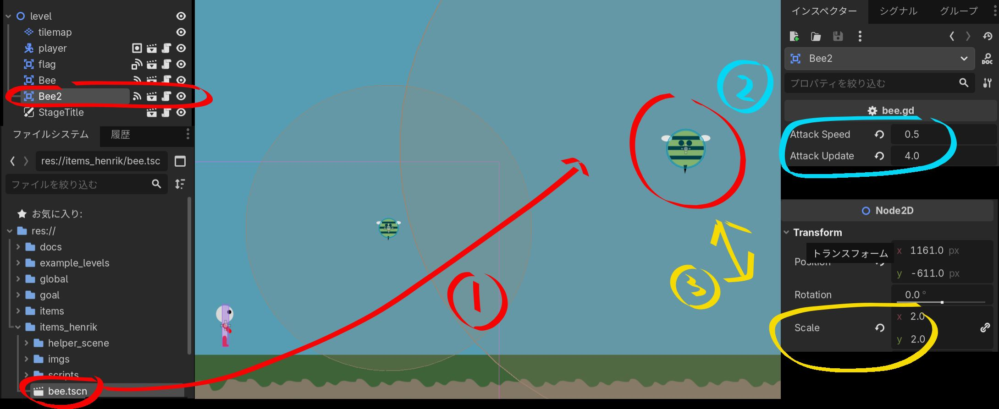

# ハチ（bee）

<!-- スクリーンショットを追加する場合：
 -->

## これは何？

**プレイヤーを追いかけてくる動く敵**です。触られるとミスになります。
プレイヤーの位置をときどき見て、そちらへ向かって飛んできます。

## ステージへの置き方

> 画像の番号（数値は一例です）：
> **①** `bee.tscn` を置く　**②** `Attack Speed`／`Attack Update` で追いかけ方を決める
> **③** `Scale` でハチの大きさを変える

1. FileSystem で `items_henrik/bee.tscn` を選びます。
2. 自分のステージの**キャンバスにドラッグ＆ドロップ**します（画像の①）。
3. スタート地点から少しはなして置くと、フェアな難しさになります。

## 設定（Inspector）

| 項目 | 意味 | 標準 |
| --- | --- | --- |
| `attack_speed` | 追いかける速さ。大きいほどすばやく迫ります。（画像の②） | `1` |
| `attack_update` | ねらいを更新する速さ。大きいほど細かくプレイヤーを追います。（画像の②） | `2` |

> 💡 ハチは触ると `died`（ミス）の合図を出します。倒す仕組みはなく、
> **よける敵**として使います。

## 簡単な改造アイデア

- `attack_speed` を小さくする → ゆっくりで、かわしやすいハチ。
- `attack_speed` を大きくする → しつこく追ってくる強敵。
- `Scale`（Node2D の大きさ）を大きくする → 大きくて迫力のあるハチ（画像の③）。
  当たり判定も一緒に大きくなります。
- 何びきか並べて置く → よけながら進むスリルのあるステージ。

[← アイテム一覧へ戻る](index.md)
