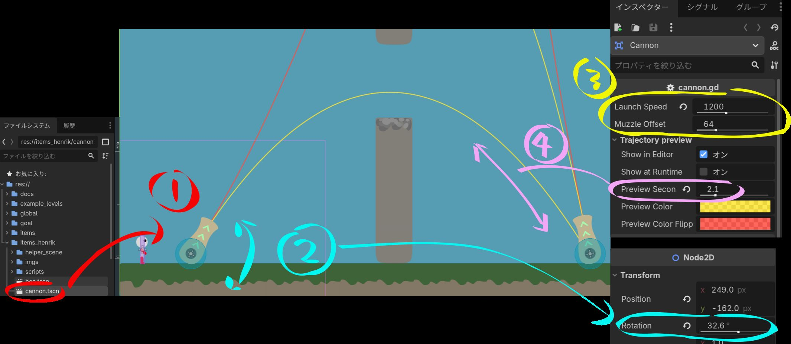

# 大砲（cannon）

<!-- スクリーンショットを追加する場合：
 -->

## これは何？

中に入ったプレイヤーを、**大砲の向いている方向へ発射**するアイテムです。
遠くの足場へ飛ばしたり、空中のコースを作ったりできます。
エディタ上には**飛ぶ道すじ（トラジェクトリ）のプレビュー線**が表示されるので、
ねらいを合わせやすくなっています。

## ステージへの置き方

> 画像の番号（数値は一例です）：
> **①** `cannon.tscn` を置く　**②** `Cannon` を回転させて向きを決める
> **③** `Launch Speed` で飛ぶ距離　**④** `Preview Seconds` で道すじ線の長さ

1. FileSystem で `items_henrik/cannon.tscn` を選びます。
2. 自分のステージの**キャンバスにドラッグ＆ドロップ**します（画像の①）。
3. **`Cannon` ノードを回転**させて、発射する向きを決めます（画像の②、
   回転 0 度＝真上）。エディタに出る線で着地点をたしかめましょう。

## 設定（Inspector）

| 項目 | 意味 | 標準 |
| --- | --- | --- |
| `launch_speed` | 発射する速さ。大きいほど遠くへ飛びます。（画像の③） | `900` |
| `muzzle_offset` | 砲口の位置（プレイヤーが出てくる場所の距離）。 | `64` |
| **Trajectory preview グループ** | | |
| `show_in_editor` | エディタで道すじの線を表示する。 | オン |
| `show_at_runtime` | ゲーム中にも線を表示する。 | オフ |
| `preview_seconds` | 何秒ぶんの道すじを描く／飛ぶか。（画像の④） | `2.0` |
| `preview_color` / `preview_color_flipped` | 線の色（重力反転時の色）。 | なし |

> 💡 向きは**ノードの回転**で決めます。プレビュー線を見ながら、着地させたい
> 足場に合うように角度と `launch_speed` を調整しましょう。

## 簡単な改造アイデア

- `launch_speed` を大きくする → 遠くの足場までひとっ飛び。
- ななめ上に回転させる → 山なりに飛ぶジャンプ台のような大砲。
- 真横に向ける → 横スクロールの発射装置に。

[← アイテム一覧へ戻る](index.md)
