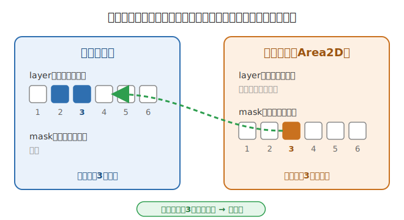

# アイテムを一から自作する（ステップ・バイ・ステップ）

[チュートリアル 6章](index.md#6応用簡単なアイテムを自作する) の続きです。
ここでは、`items/item_speed.tscn`（さわると速くなるアイテム）のような部品を、
**まっさらな状態から自分で組み立てる**手順を通して説明します。

作るのは1個の**独立した部品**だけです。`player.gd` も `world.gd` も
書き変えません（これがこのゲームの「アドイン」方式です）。

---

## まず「当たり判定（コリジョン）」を知ろう

アイテムは、プレイヤーが**近づいたことに気づく**必要があります。この
「気づくしくみ」が **当たり判定（コリジョン）** です。Godot では2つの設定で
決まります。



- **layer（レイヤー）＝「自分がいる場所」。** 自分が何番の部屋にいるかを表します。
- **mask（マスク）＝「見はる相手の場所」。** 何番の部屋を見張るかを表します。

**自分の mask に入れた番号の部屋に、相手の layer があると、はじめて反応します。**
番号は1から順に、チェックボックスで選びます。

> ℹ️ **このゲームでの決まり（ここが大事）**
> このゲームでは、**プレイヤーはレイヤー3にいます**。だからアイテムは、
> 自分の **layer は「からっぽ」** にして、**mask のチェックボックス3だけ**を
> オンにします。こうすると「プレイヤーだけを見はる部品」になります。
> この「3番」という数字は**このゲーム独自の決まり**で、Godot がいつも3番、
> というわけではありません。お手本の `item_speed.tscn` も同じ設定です。

---

## 作る手順

<!-- スクリーンショットを追加する場合は、bee_howto.jpg と同じように
     images/making-items/ に置いてここから参照してください。例：
 -->

### ① 新しいシーンを作り、ルートを `Area2D` にする

1. メニューの **「シーン → 新規シーン」** を選びます。
2. 「ルートノードを生成」で **「その他のノード」** を押し、**`Area2D`** を選びます。
3. できたルートノードの名前を、分かりやすいもの（例：`SpeedItem`）に変えます。

> 💡 ルートを **必ず `Area2D`** にするのがポイントです。`Area2D` は「範囲に
> 入った・出た」を教えてくれるノードで、アイテムの心臓部です。

### ② 当たり判定の形（`CollisionShape2D`）を足す

1. ルートの `Area2D` を右クリック → **「子ノードを追加」** → **`CollisionShape2D`**。
2. Inspector の **`Shape`** を押し、**「新規 CircleShape2D」**（丸）などを選びます。
   四角にしたいときは **`RectangleShape2D`** を選びます。
3. キャンバスに出た**まるいハンドルをドラッグ**して、当たり判定の大きさを
   決めます。

### ③ 見た目の絵（`Sprite2D`）を足す

1. もう一度ルートの `Area2D` に、**子ノード `Sprite2D`** を足します。
2. Inspector の **`Texture`** に、使いたい絵をドラッグします。
   絵は Microsoft ペイントなどで描いて、プロジェクトのフォルダに入れておくと、
   FileSystem に出てきます。
3. 大きすぎ・小さすぎたら、`Sprite2D` の **`Scale`** で調整します。

### ④ 当たり判定の相手（layer と mask）を設定する

1. ルートの `Area2D` をクリックします。
2. Inspector で **`Collision`** の項目を開きます。
3. **`Layer`** のチェックは**全部オフ**にします（自分の場所は「なし」）。
4. **`Mask`** は、**チェックボックス3だけ**をオンにします（プレイヤーを見はる）。

> 💡 最初は `Layer` も `Mask` も「1」がオンになっています。**1のチェックを外す**
> のを忘れないようにしましょう。（上の当たり判定の図も見てください。）

### ⑤ スクリプト（動きのプログラム）を付ける

1. ルートの `Area2D` を右クリック → **「スクリプトをアタッチ」**。
2. そのまま「作成」を押すと、`extends Area2D` から始まる空のスクリプトが
   できます。
3. 中身は、次の「例」の章のコードを書きます。

### ⑥ `body_entered` の合図を関数につなぐ

1. ルートの `Area2D` をクリックし、Inspector の右にある **「ノード」** タブ →
   **「シグナル」** を開きます。
2. **`body_entered`** をダブルクリックし、**「接続」** を押します。
3. これで、プレイヤーが範囲に入ったときに **`_on_body_entered`** 関数が
   呼ばれるようになります。

### ⑦ 保存して、ステージに置く

1. **Ctrl+S** で、`items/` フォルダなどに `.tscn` として保存します。
2. できた `.tscn` を、自分のステージの**キャンバスにドラッグ＆ドロップ**します。
3. **F5** で実行して、プレイヤーがさわったときの動きをたしかめましょう。

---

## `@export` を使うと、置いたあとに調整できる

コードの中で変数の前に **`@export`** を付けると、その値が **Inspector に出てきます。**

```gdscript
@export var SPEED_BONUS = 150.0  # 足す速さ
```

こうしておくと、**同じアイテムを2個置いても、1個ずつ別の値**にできます。
たとえば「弱いスピードアップ」と「強いスピードアップ」を、コードを書き直さずに
**Inspector の数字を変えるだけ**で作り分けられます。これが `@export` の便利な
ところで、このゲームのアイテムがどれも Inspector で調整できるのは、この
しくみのおかげです。

---

## 例（やさしい順に3つ）

### 例1：トラップ（さわるとミス）

一番みじかいアイテムです。さわると `died`（ミス）の合図をプレイヤーに送ります。

```gdscript
extends Area2D
# さわるとミスになるトラップ

func _on_body_entered(body: Node2D) -> void:
    body.died.emit()   # プレイヤーに「ミス」の合図を送る
```

> 💡 `died` はプレイヤーが持つ**シグナル（合図）**なので、`body.died()` ではなく
> **`body.died.emit()`** と書きます。ハチやノコギリも中では同じことをしています。

### 例2：スピードアップ

さわると走る速さが増える、使い切りのアイテムです（お手本の `item_speed.gd` と
同じ考え方）。

```gdscript
extends Area2D
# さわると速くなるアイテム

@export var SPEED_BONUS = 150.0  # 足す速さ

func _on_body_entered(body: Node2D) -> void:
    body.SPEED += SPEED_BONUS   # プレイヤーを速くする
    queue_free()                # アイテムを消す（使い切り）
```

改造アイデア：`body.SPEED` を `body.JUMP_VELOCITY` にするとジャンプ力アップ
（`JUMP_VELOCITY` はマイナスが上向きなので、**引く**ほど高く跳びます）。

### 例3（応用）：時間つき重力チェンジ（ふうせん）

さわると**しばらくの間だけ**ふわっと軽くなり、少ししたら元にもどるアイテムです。
新しいことを3つ使います。

- **グループ**（`add_to_group` / `get_nodes_in_group`）… 同じ仲間をまとめて扱う。
- **`await` とタイマー** … 「◯秒待ってから続き」を書く。
- **`set_deferred`** … 当たり判定を安全に切り替える（`_on_body_entered` の途中で
  当たり判定を直接いじると Godot にしかられるので、これを使います）。

`CollisionShape2D` の名前が **`CollisionShape2D`**（作ったときの標準の名前）で
あることを前提にしています。

```gdscript
extends Area2D
# 応用：さわると少しの間だけ「ふわっと」軽くなるアイテム（ふうせん）。
# しばらくすると元の重さにもどります。

@export var GRAVITY_FACTOR = 0.05  # 重力を何倍にするか（小さいほど軽い）
@export var TIME = 2.0             # 効果がつづく秒数

@onready var collision_shape_2d: CollisionShape2D = $CollisionShape2D

func _ready() -> void:
    add_to_group("balloon")   # 同じ「ふうせん」グループに入れておく

func _on_body_entered(body: Node2D) -> void:
    # 画面にある全部の「ふうせん」を、いったん見えなく・さわれなくする
    var balloons = get_tree().get_nodes_in_group("balloon")
    for balloon in balloons:
        balloon.visible = false
        balloon.collision_shape_2d.set_deferred("disabled", true)

    body.GRAVITY_SCALE *= GRAVITY_FACTOR   # 軽くする

    await get_tree().create_timer(TIME).timeout   # TIME 秒だけ待つ

    body.GRAVITY_SCALE /= GRAVITY_FACTOR   # 元の重さにもどす

    # ふうせんをまた出す
    for balloon in balloons:
        balloon.visible = true
        balloon.collision_shape_2d.set_deferred("disabled", false)
```

> 💡 **なぜ全部の「ふうせん」を消すの？** 効果が続いている間は、グループにいる
> ふうせんを**すべて**さわれなくしています（`disabled = true`）。だから「効果中に
> もう1つのふうせんにさわって重力が二重にかかる」ことは起きません。TIME 秒たつと
> まとめて元にもどります。これがグループを使う理由です。
> （ただし、ふうせん以外に重力を変えるアイテムを同時に使うと、もどし方がずれる
> ことはあります。）

---

> 💡 **共通ルール**：どの例も `player.gd` / `world.gd` を書き変えていません。
> プレイヤーの公開変数（`SPEED` / `JUMP_VELOCITY` / `GRAVITY_SCALE` / `scale`）と
> シグナル（`died` / `level_complete`）だけを通してはたらいています。

[← チュートリアルへ戻る](index.md)　／　[アイテム図鑑へ](items/index.md)
